# 已完成
* 初始化样式
* scss
* layout
* 别名和环境配置
* 路由动画
* 全屏
* 暗黑模式
* element-plus和自定义i18n
* 组件缓存
* 面包屑+动画
* axios(包括二次封装,接口解耦合)
* 简单登录页面
* 登录接口+登录用户信息接口
* 登录路由拦截(判断token存在、合法、过期)
* 优化公有路由和私有路由
* 用户退出登录

# 计划代办事项
* 完善i18n(路由...)
* 动态路由
* 登录页面(考虑使用tailwindcss，考虑登录页面)
* Loading
* 登录操作(token)
* 登录后根据后端路由数据进行动态路由匹配
* echarts并完成控制台页面
* table表格(封装)
* dialog(封装)
* ...

# 一、初始化项目

## 项目初始目录结构

* node_modules：项目安装的第三方包的存放目录。
* public：存放不需要编译构建的纯静态资源的目录。
* src：基本上所有需要编译构建的资源，都存放在src目录，打包构建，主要就是构建src中的代码。
* src/main.js：项目的启动入口文件，项目中用到的全局组件、依赖都可以在此处注册。
* src/App.vue：项目的根组件。
* components：存放非路由、公共的，在多个组件中多次复用的组件。放在此处的组件的名称一般采用大驼峰命名。
* assets：存放一些需要编译构建的纯静态资源。
* .gitignore：声明哪些文件不需要git版本管理的配置文件。
* index.html：单页面文件的页面文件。
* package-lock.json：存放着项目所用到的第三方包的一些信息记录，包含了包的版本、下载地址等等。
* package.json：存放着项目开发环境和生产环境所用到的依赖信息，以及一些npm脚本。
* README.md：项目说明文档。
* vite.config.js：vite的配置文件，所有vite的相关配置都在这里进行配置。

## 项目定制目录结构

在src目录里面创建文件目录：

* api：接口存放目录。
* router：存放项目中路由相关的模块。
* styles：存放全局样式表。
* store：存储pinia状态管理的模块。
* layout：布局的意思，存放公共的布局组件。
* utils：存放项目中使用到的工具函数。
* plugins：存放注册给vue的一些插件，或是给vue注册的实例原型方法。
* views：存放项目中的路由组件。此处的组件命名通常使用小写字母多个单词使用-连接。
* composables：存放项目中提取出来的、封装的组合式API函数。

## 提交到git版本管理
作用：代码备份、历史记录、多人协作。

1.初始化一个本地空的git仓库
```bash
git init
```
2.将所有修改添加到本地暂存区
```bash
git add .
```
3.提交至本地仓库
```bash
git commit -m "备注"
```
4.连接远程仓库
```bash
git remote add origin 仓库地址
```
5.查看连接的仓库地址
```bash
git remote -v
```
6.提交到远程仓库
```bash
git push -u origin master / git push -u origin master:master(本地分支:远程分支)
```
origin = 仓库地址，就是仓库地址的别名。
-u的意思是将这次提交到 origin master 记录下来，下次提交同一个地址和仓库就直接push就可以了。
意思是将本地master分支的代码推送到线上的master分支上去。

# 二、ESlint代码规范+Prettier格式化+stylelint样式代码规范校验

vite创建的项目是默认没有集成ESLint的，所以我们需要手动去安装配置ESLint。
### 安装并配置 ESLint

```bash
npm init @eslint/config
```
```text
√ How would you like to use ESLint? # 你想如何使用eslint     
> To check syntax, find problems, and enforce code style

√ What type of modules does your project use?  # 你的项目使用什么类型的模块
> JavaScript modules (import/export)

√ Which framework does your project use?  # 你的项目使用哪个框架
> Vue.js

√ Does your project use TypeScript? · No / Yes # 是否使用TypeScript
> Yes

√ Where does your code run? # 你的代码在哪里运行
> browser

√ How would you like to define a style for your project? · guide # 您希望如何为您的项目定义样式?
> Use a popular style guide
√ Which style guide do you want to follow?  # 您想遵循哪一种风格指南
> standard-with-typescript

√ What format do you want your config file to be in?# 你希望你的配置文件是什么格式?
> JavaScript

√ Would you like to install them now? # 您现在要安装它们吗
> Yes

√ Which package manager do you want to use? # 您想使用哪个包管理器
> pnpm 
```
### 验证项目中代码是否符合ESLint的验证规范
package.json添加node脚本：
```json
 "scripts": {
    "lint": "eslint ./src/**/*.{js,jsx,vue,ts,tsx} --fix"
  },
```
注意：在{}中的文件类型之间不能有空格，例如：{js, ts, tsx, jsx, vue}这样是会报错的。
### eslint' 不是内部或外部命令
1.删除项目目录中的node_modules文件夹。
2.重新安装
```bash
npm install
```
添加"lint"，脚本的意义：运行这命令，验证指定目录下的文件的代码风格是否符合规范。
这里对src下面的任意目录下的任意名字的js、jsx、vue、ts、tsx文件进行验证。
--fix：简单的不符合代码规范的，自动帮你格式化。

### 运行遇到的报错：
#### 问题一：
找不到模块"xxx"或其相应的类型声明。
解决方法：
安装@types/node：
```bash
npm install --save-dev @types/node
```
#### 问题二：
Error: Error while loading rule '@typescript-eslint/dot-notation': You have used a rule which requires parserServices to be generated. You must therefore provide a value for the "parserOptions.project" property for @typescript-eslint/parser.
解决方法：
在`.eslintrc.cjs`中添加：
```js
parserOptions: {
  // eslint缺少ts类型检测，需要引入此扩展
  parser: '@typescript-eslint/parser',
  project: ['./tsconfig.json']
}
```
#### 问题三：
Parsing error: ESLint was configured to run on `/src\App.vue` using parserOptions.project`: /tsconfig.json
The extension for the file (`.vue`) is non-standard. You should add `parserOptions.extraFileExtensions` to your config
解决方法：
在.eslintrc.cjs中添加：
```js
parserOptions: {
  extraFileExtensions: ['.vue']
}
```

#### 问题四:
Do not use a triple slash reference for vite/client, use import style instead  @typescript-eslint/triple-slash-reference
不支持三斜杠引入。
解决方法： 关闭这个规则
```js
rules: {
'@typescript-eslint/triple-slash-reference': 'off'
}
```

#### 问题五：
Parsing error: ESLint was configured to run on <tsconfigRootDir>/.eslintrc.cjs using parserOptions.project: /tsconfig.json
提示使用了parserOptions.project.但是tsconfig.json不包含本文件

解决方法： 在tsconfig.json的include数组中加入.eslintrc.cjs.重启生效
```bash
"include": [
    "src/**/*.ts",
    "src/**/*.d.ts",
    "src/**/*.tsx",
    "src/**/*.vue",
    ".eslintrc.cjs"
]
```
#### 问题六：
Parsing error: Unexpected token )eslint
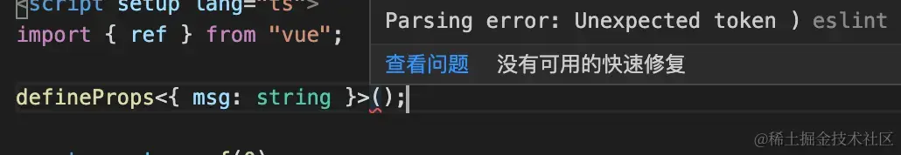

解决方法 在.eslintrc.cjs中添加：
```js
parser: '@typescript-eslint/parser'
```

#### 问题七：
Cannot find module 'vue'. Did you mean to set the 'moduleResolution' option to 'node', or to add aliases to the 'paths' option?
找不到模块'vue'。您的意思是将' modulerresolve '选项设置为'node'，还是为'paths'选项添加别名?

解决方法： 在tsconfig.json中，将moduleResolution的值设置为：node

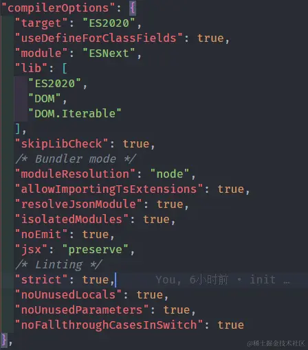 
```json
"moduleResolution": "node"
```

#### 问题八：
Module '"e:/ZDD/Desktop/vite-project/src/components/HelloWorld.vue"' has no default export.
解决方法：

将Vetur禁用，启用Volar。

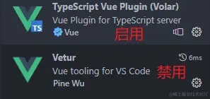
#### 问题九
解决ts无法识别引入的.vue文件：
```js
declare module "*.vue"{
    import { DefineComponent } from "vue"
    // eslint-disable-next-line @typescript-eslint/no-explicit-any, @typescript-eslint/ban-types
    const component: DefineComponent<{}, {}, any>
    export default component
}
```

### 编译器集成ESLint

#### 编译器提示不符合ESLint语法规范错误

* 1.禁用vetur插件

* 2.安装eslint插件
  只要安装启用了这个插件，它就会自动查找项目中的 eslint配置规范，并且给出验证提示。

* 3.安装volar插件

#### 按照项目中的ESLint规则要求格式化代码

ESLint提供了格式化工具，但是需要手动配置才能使用。
设置 ---> 扩展 ---> ESLint ---> Format: Enable √

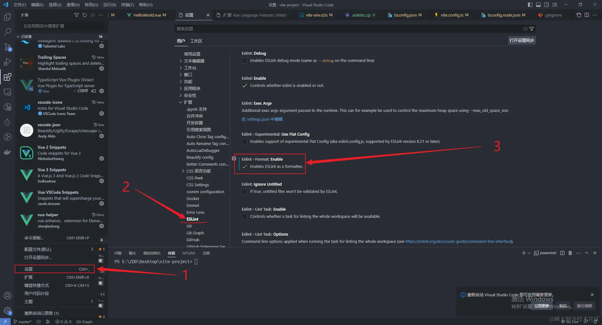

将图上的勾选，表示启用eslint插件作为格式化工具。

## 创建.eslintignore文件，忽略eslint不需要检查的文件
```text
/index.html
/tsconfig.json
/src/vite-env.d.ts
/.preitterrc.json
```

## 配置prettier

* 1.

* 安装`prettier`、`eslint-config-prettier`、`eslint-plugin-prettier`

  * [eslint-plugin-prettier](https://link.juejin.cn?target=https%3A%2F%2Fgithub.com%2Fprettier%2Feslint-plugin-prettier)： 基于 prettier 代码风格的 eslint 规则，即eslint使用pretter规则来格式化代码。
  * [eslint-config-prettier](https://link.juejin.cn?target=https%3A%2F%2Fgithub.com%2Fprettier%2Feslint-config-prettier)： 禁用所有与格式相关的 eslint 规则，解决 prettier 与 eslint 规则冲突，**确保将其放在 extends 队列最后，这样它将覆盖其他配置**

  ```bash
  pnpm add prettier eslint-plugin-prettier eslint-config-prettier --save-dev
  
  npm install prettier eslint-plugin-prettier eslint-config-prettier --save-dev
  ```

  

* 2.项目根目录创建`.prettierrc.js`：

```js
module.exports = {
    tabWidth: 2, // 一个tab代表几个空格数，默认为2
    singleQuote: true, // 字符串是否使用单引号，默认为false，使用双引号
    semi: false, // 行末是否使用分号，默认为true
    printWidth: 120,  // 一行的字符数，如果超过会进行换行，默认为80
    trailingComma: "none" // 是否使用尾逗号，有三个可选值"<none|es5|all>"
}
```

规则也可以自行到[prettier](https://link.juejin.cn/?target=https%3A%2F%2Fprettier.io%2F)官网配置。

## 安装配置stylelint

[stylelint](https://link.juejin.cn/?target=https%3A%2F%2Fstylelint.io%2F)为css的代码规范校验工具。可用来统一css代码规范，检查css语法错误与不合理的写法，指定css书写顺序，格式化css代码等...

#### 安装stylelint相关依赖

```bash
pnpm add stylelint postcss postcss-scss postcss-html stylelint-config-prettier-scss stylelint-config-standard-scss stylelint-config-standard stylelint-config-standard-vue stylelint-order stylelint-scss --save-dev


```

* [stylelint](https://link.juejin.cn?target=https%3A%2F%2Fstylelint.io%2F): `css`书写规范校验工具

* [postcss](https://link.juejin.cn?target=https%3A%2F%2Fwww.postcss.com.cn%2F): 将最新的 CSS 语法转换成大多数浏览器都能理解的语法

* [postcss-scss](https://link.juejin.cn?target=https%3A%2F%2Fgithub.com%2Fshellscape%2Fpostcss-scss): 将变量解析为属性，以便 PostCSS 插件可以将 SCSS 源代码与 CSS 一起转换。

* [postcss-html](https://link.juejin.cn?target=https%3A%2F%2Fgithub.com%2Fgucong3000%2Fpostcss-html): 识别html/vue 中的`<style></style>`标签中的样式

* [stylelint-config-standard](https://link.juejin.cn?target=https%3A%2F%2Fgithub.com%2Fstylelint%2Fstylelint-config-standard): `Stylelint`的标准可共享配置规则，详细可查看官方文档

* [stylelint-config-prettier](https://link.juejin.cn?target=https%3A%2F%2Fgithub.com%2Fprettier%2Fstylelint-config-prettier): 关闭所有不必要或可能与`Prettier`冲突的css和scss规则。

* [stylelint-config-standard-scss](https://link.juejin.cn?target=https%3A%2F%2Fgithub.com%2Fssivanatarajan%2Fstylelint-config-standard-scss): `scss`的标准配置规则，详细可查看官方文档

* [stylelint-config-standard-vue](https://link.juejin.cn?target=https%3A%2F%2Fgithub.com%2Fota-meshi%2Fstylelint-config-standard-vue): 标准可共享 `Vue` 配置

* [stylelint-scss](https://link.juejin.cn?target=https%3A%2F%2Fgithub.com%2Fssivanatarajan%2Fstylelint-scss): `scss`的`stylelint`规则集合

* [stylelint-order](https://link.juejin.cn?target=https%3A%2F%2Fgithub.com%2Fhudochenkov%2Fstylelint-order): 指定样式书写的顺序，在`.stylelintrc.js`中`order/properties-order`指定顺序

#### 增加.stylelintrc配置

```json
{
  // 扩展
  "extends": [
    "stylelint-config-standard",
    "stylelint-config-prettier-scss",
    "stylelint-config-standard-scss",
    "stylelint-config-standard-vue/scss"
  ],
  // 插件
  "plugins": [
    "stylelint-order"
  ],
  // 不同格式的文件指定自定义语法
  "overrides": [
    {
      "files": [
        "**/*.(scss|css|vue|html)"
      ],
      "customSyntax": "postcss-scss"
    },
    {
      "files": [
        "**/*.(html|vue)"
      ],
      "customSyntax": "postcss-html"
    }
  ],
  "ignoreFiles": [  // 不需要样式校验的文件
    "**/*.js",
    "**/*.jsx",
    "**/*.tsx",
    "**/*.ts",
    "**/*.json",
    "**/*.md",
    "**/*.yaml",
    "dist/**",
    "node_modules/**"
  ],
  "rules": {
    "no-descending-specificity": null,  // 禁止在具有较高优先级的选择器后出现被其覆盖的较低优先级的选择器
    "selector-pseudo-element-no-unknown": [  // 禁止未知的伪元素选择器
      true,
      {
        "ignorePseudoElements": [  // v-deep 视为可用的伪元素选择器
          "v-deep"
        ]
      }
    ],
    "selector-pseudo-class-no-unknown": [ // 禁止使用未知的选择器伪类
      true,
      {
        "ignorePseudoClasses": [
          "deep"                 // deep 视为可用的选择器伪类
        ]
      }
    ],
    // 指定css样式书写的顺序
    "order/properties-order": [
      "position",
      "top",
      "right",
      "bottom",
      "left",
      "z-index",
      "display",
      "justify-content",
      "align-items",
      "float",
      "clear",
      "overflow",
      "overflow-x",
      "overflow-y",
      "padding",
      "padding-top",
      "padding-right",
      "padding-bottom",
      "padding-left",
      "margin",
      "margin-top",
      "margin-right",
      "margin-bottom",
      "margin-left",
      "width",
      "min-width",
      "max-width",
      "height",
      "min-height",
      "max-height",
      "background",
      "background-position",
      "background-repeat",
      "background-size",
      "background-color",
      "background-clip",
      "border",
      "border-style",
      "border-width",
      "border-color",
      "border-top-style",
      "border-top-width",
      "border-top-color",
      "border-right-style",
      "border-right-width",
      "border-right-color",
      "border-bottom-style",
      "border-bottom-width",
      "border-bottom-color",
      "border-left-style",
      "border-left-width",
      "border-left-color",
      "border-radius",
      "opacity",
      "filter",
      "list-style",
      "outline",
      "visibility",
      "box-shadow",
      "text-shadow",
      "resize",
      "transition",
      "color",
      "font-size",
      "font-family",
      "text-align",
      "text-justify",
      "text-indent",
      "text-overflow",
      "text-decoration",
      "white-space"
    ]
  }
}
```

#### package.json添加脚本

```json
{
 "scripts": {
    "lint:style": "stylelint \"./**/*.{css,scss,vue,html}\" --fix"
  }
}
```

#### vscode安装stylelint插件

安装该插件可在我们保存代码时自动执行stylelint


```json
{
    // 开启自动修复
    "editor.codeActionsOnSave": {
      "source.fixAll": false,
      "source.fixAll.eslint": true,
 +    "source.fixAll.stylelint": true
    },
    // 保存的时候自动格式化
    "editor.formatOnSave": true,
    // 默认格式化工具选择prettier
    "editor.defaultFormatter": "esbenp.prettier-vscode",
    // 配置该项，新建文件时默认就是space：2
    "editor.tabSize": 2,
    // stylelint校验的文件格式
  + "stylelint.validate": ["css", "less", "vue", "html"]
  }
```

# 三、添加生成Vue3模板的配置

1. 在项目根目录的`.vscode`文件夹下新建 `vue3.0.code-snippets`文件
2. 在`vue3.0.code-snippets`中将下面的代码片段复制粘贴进去：

```json
{
    "Vue3.0快速生成模板": {
        "prefix": "Vue3.0",
        "body": [
            "<template>",
            "\t<div>\n",
            "\t</div>",
            "</template>\n",
            "<script setup lang='ts'>",
            "defineOptions({",
            "\tname: ''",
            "})\n",
            "</script>\n",
            "<style lang='scss' scoped>\n",
            "</style>",
            "$2"
        ],
        "description": "Vue3.0"
    }
}
```

# 四、在git commit提交的时候进行代码规范校验

## 配置git commit提交规范

在提交代码到git仓库之前，Eslint自动的去验证代码规范，防止不符合规范的代码提交到git仓库中。

### 安装lint-staged

[lint-staged](https://link.juejin.cn/?target=https%3A%2F%2Fgithub.com%2Fokonet%2Flint-staged%23examples)的作用是针对暂存的 git 文件运行 linter，对代码进行规范检查，怎么进行检查需要自己进行配置，并且不要让💩滑入您的代码库！

```bash
npm install --save-dev lint-staged
```

### 安装husky

提供git钩子的工具，设置在提交（commit）代码的时候通过 git hook 来运行*lint-staged*。

[husky](https://link.juejin.cn/?target=https%3A%2F%2Fgithub.com%2Ftypicode%2Fhusky)这个工具就类似于**请求拦截器**在git commit或者是git push的时候去做点什么。

```bash
npx husky-init && npm install
```

运行这个命令会：

1. 添加`prepare: 'husky install'`脚本到`package.json`，添加完这个命令，别人拉取代码`npm install`时会自动执行**prepare**命令，保证别人拉取的代码也有git 钩子。
2. 创建一个`pre-commit`可以编辑的示例挂钩（默认情况下，`npm test`将在提交时运行）
3. 配置Git钩子路径

### 配置lint-staged

在项目根目录创建`.lintstagedrc`文件，然后使用**commonjs**模块规范向外暴露一个对象：

```js
{
    "*.{js,ts}": [
        "eslint --fix", // 通过eslint重新格式化代码
        "prettier --write" // 通过prettier重新格式化代码
      ],
      "*.{cjs,json}": [
        "prettier --write"
      ],
      "*.{vue,html}": [
        "eslint --fix",
        "prettier --write",
        "stylelint --fix"
      ],
      "*.{scss,css}": [
        "stylelint --fix",
        "prettier --write"
      ],
      "*.md": [
        "prettier --write"
      ]
}
```

### 修改.husky/pre-commit

将 **npm test** 换成 **npx lint-staged**

```bash
#!/usr/bin/env sh
. "$(dirname -- "$0")/_/husky.sh"

# npm test
npx lint-staged
```

配置好后，在**git commit**的时候就会运行**npx lint-staged**命令，从而运行**eslint**等代码规范校验工具，对代码进行规范验证。、

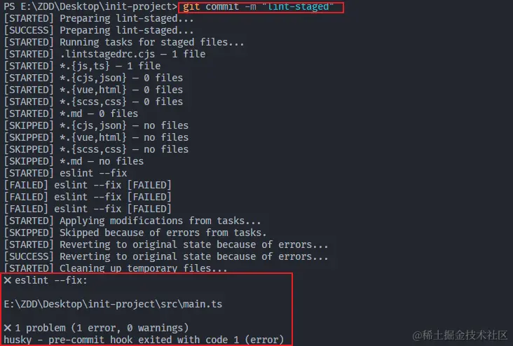

如果node版本过低，则会出现如下报错：

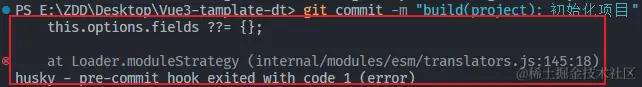

# 五、在开发（dev）和构建（build）中进行代码规范校验

## 在开发（dev）和构建（build）中进行代码规范校验

### vite-plugin-eslint

* 安装

```bash
npm install --save-dev vite-plugin-eslint
```

* 配置 `vite.config.ts`:

```js
import { defineConfig } from 'vite'
import vue from '@vitejs/plugin-vue'
import eslint from 'vite-plugin-eslint'

export default defineConfig({
plugins: [vue(), eslint()]
})
```

配置完成后记得重启项目

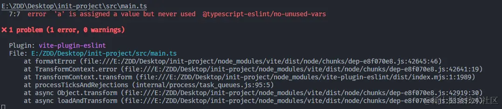

在打包构建的时候碰到了这个报错：`Could not find a declaration file for module 'vite-plugin-eslint'.`

解决：

直接在**src**目录下的**vite-env.d.ts**中添加：

```js
// 解决打包构建的时候，报错：Could not find a declaration file for module 'vite-plugin-eslint'
declare module 'vite-plugin-eslint'
```

# 六、git commit的提交规范+commit-message+changlog

## git commit提交代码的规范

## commitlint

[commitlint](https://link.juejin.cn?target=https%3A%2F%2Fgithub.com%2Fconventional-changelog%2Fcommitlint%23getting-started) 检查您的提交消息是否符合[常规提交格式](https://link.juejin.cn?target=https%3A%2F%2Fconventionalcommits.org%2F)。

```scss
复制代码type(scope?): subject

-----

feat(index): 新增了xxx
```

根据[commitlint-config-conventional （基于 Angular 约定）的](https://link.juejin.cn?target=https%3A%2F%2Fgithub.com%2Fconventional-changelog%2Fcommitlint%2Ftree%2Fmaster%2F@commitlint%2Fconfig-conventional%23type-enum)常见类型可以是：

| **类型** | **描述**                                               |
| -------- | ------------------------------------------------------ |
| build    | 编译相关的修改，例如发布版本、对项目构建或者依赖的改动 |
| chore    | 其他修改, 比如改变构建流程、或者增加依赖库、工具等     |
| ci       | 持续集成修改                                           |
| docs     | 文档修改                                               |
| feat     | 新特性、新功能                                         |
| fix      | 修改bug                                                |
| perf     | 优化相关，比如提升性能、体验                           |
| refactor | 代码重构                                               |
| revert   | 回滚到上一个版本                                       |
| style    | 代码格式修改, 注意不是 css 修改                        |
| test     | 测试用例修改                                           |

## 安装commitlint

在windows系统下安装的命令:

```scss
npm install --save-dev @commitlint/config-conventional @commitlint/cli
```

## 添加 commit-msg 钩子

前提是已经安装并初始化过**husky**，如果未初始化过请看**第五章**

```bash
npx husky add .husky/commit-msg
```

**.husky/commit-msg**： 将undefined替换成**npx --no -- commitlint --edit ${1}**

```bash
#!/usr/bin/env sh
. "$(dirname -- "$0")/_/husky.sh"

npx --no -- commitlint --edit ${1}
```

**创建.commitlintrc.js**：

```js
module.exports = {extends: ['@commitlint/config-conventional']}
```

当git commit提交到本地仓库的时候，如果**commit message**不符合规范，终端会有类似提示：

比如：

```bash
复制代码git commit -m "123123"
```

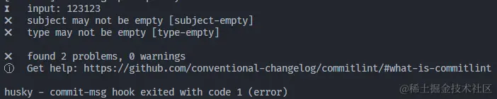

input: 表示你输入的git message信息;

subject may not be empty：subject不能为空;

type may not be empty：type不能为空;

修改成：

```bash
git commit -m "feat(init): 添加了commitlint,git提交规范校验"
```

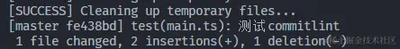

显示这个就说明已经成功提交到本地缓存区啦！

值得注意的是，在 **type(scope?):** 里的 **:** 是英文半角的，并且与**subject描述**之间有一个空格。

## commit可视化

虽然git commit的规范是有了，但是每一次都需要手动的去敲，并且[header](https://link.juejin.cn/?target=scope)也不是很好记，所以决定使用commit可视化工具：[cz-git](https://link.juejin.cn/?target=https%3A%2F%2Fcz-git.qbb.sh%2Fzh%2Fguide%2F)。

### 安装

1.全局安装**commitizen**:

```bash
复制代码npm install -g commitizen
```

2.在项目中安装[cz-git](https://link.juejin.cn/?target=https%3A%2F%2Fcz-git.qbb.sh%2Fzh%2Fguide%2F):

```bash
npm install -D cz-git
```

3.修改 `package.json` 添加 `config` 指定使用的适配器:

```bash
{ .
    "scripts": {...}, 
    "config": { 
        "commitizen": { 
            "path": "node_modules/cz-git" 
        } 
    } 
}
```

4.添加自定义配置(可选，使用默认)

**cz-git 与 [commitlint](https://link.juejin.cn/?target=https%3A%2F%2Fgithub.com%2Fconventional-changelog%2Fcommitlint) 进行联动给予校验信息**，所以可以编写于 [commitlint](https://link.juejin.cn/?target=https%3A%2F%2Fgithub.com%2Fconventional-changelog%2Fcommitlint%23config) 配置文件之中。

```js
// .commitlintrc.js


/** @type {import('cz-git').UserConfig} */

export default {
  extends: ['@commitlint/config-conventional'],
  prompt: {
    alias: { fd: 'docs: fix typos' },
    messages: {
      type: '选择你要提交的类型 :',
      scope: '选择一个提交范围（可选）:',
      customScope: '请输入自定义的提交范围 :',
      subject: '填写简短精炼的变更描述 :\n',
      body: '填写更加详细的变更描述（可选）。使用 "|" 换行 :\n',
      breaking: '列举非兼容性重大的变更（可选）。使用 "|" 换行 :\n',
      footerPrefixesSelect: '选择关联issue前缀（可选）:',
      customFooterPrefix: '输入自定义issue前缀 :',
      footer: '列举关联issue (可选) 例如: #31, #I3244 :\n',
      confirmCommit: '是否提交或修改commit ?'
    },
    // type
    types: [
      { value: 'feat', name: 'feat:     新增功能 ✨ A new feature' },
      { value: 'fix', name: 'fix:      修复缺陷 🐛 A bug fix' },
      { value: 'docs', name: 'docs:     文档更新 ✏️ Documentation only changes' },
      { value: 'style', name: 'style:    代码格式 🎨 Changes that do not affect the meaning of the code' },
      {
        value: 'refactor',
        name: 'refactor: 代码重构 ♻ A code change that neither fixes a bug nor adds a feature'
      },
      { value: 'perf', name: 'perf:     性能提升 ⚡ A code change that improves performance' },
      { value: 'test', name: 'test:     测试相关 🧪 Adding missing tests or correcting existing tests' },
      {
        value: 'build',
        name: 'build:    打包构建 📦️ Changes that affect the build system or external dependencies'
      },
      { value: 'ci', name: 'ci:       持续集成 💚 Changes to our CI configuration files and scripts' },
      { value: 'revert', name: 'revert:   回退代码 ⏪️ Revert to a commit' },
      { value: 'chore', name: 'chore:    构建/工程依赖/工具 🎉 Other changes that do not modify src or test files' }
    ],
    useEmoji: true,
    emojiAlign: 'center'
  }
}
```

更多配置以及配置模板可以到cz-git官网查看：[配置模板](https://link.juejin.cn/?target=https%3A%2F%2Fcz-git.qbb.sh%2Fzh%2Fconfig%2F)。

还可以在`paceage.json`的`script`脚本中添加`commit`脚本，这样会比较方便一些，只需要运行一下这个命令即可实现添加到缓存区并提交到本地仓库中：

```json
"scripts": {
    "commit": "git add -A && cz && git push"
},
```

### 效果

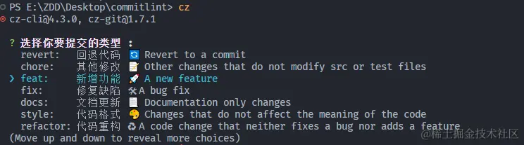

## 提交信息开头添加emoji

**具体效果如下：**

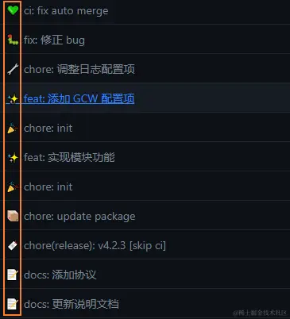

**实现步骤：**

1.安装**commitlint-config-gitmoji**和**commitlint**

[commitlint-config-gitmoji](https://link.juejin.cn/?target=https%3A%2F%2Fgithub.com%2Farvinxx%2Fgitmoji-commit-workflow%2Fblob%2Fmaster%2Fpackages%2Fcommitlint-config)

```bash
npm install --save-dev commitlint-config-gitmoji commitlint
```

2.添加配置项

在`.commitlintrc.js`文件中将`extends`配置项中的 **@commitlint/config-conventional** 换成 **gitmoji**：

```js
module.exports = {
  extends: ['gitmoji'],
}
```

如果不修改的话会报错：

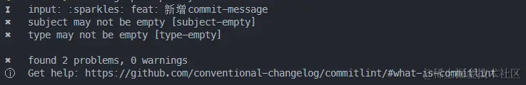

这是因为 **@commitlint/config-conventional** 默认的预设是 angular ，像这种自定义表情的commmit，规范和angular不一样，它读不到对应的**type**生成的更改日志是没法分类就会报错，所以我们要换成使用**gitmoji**，并且在后面的**changelog**中添加emoji也是需要使用到**gitmoji**的，不然emoji表情不会显示。

3.为`.commitlintrc.js`中的`prompt.types`配置项的每一个数组元素的**value**值的开头添加**emoji**：

```js
prompt: {
    // types
    types: [
      { value: ':sparkles: feat', name: 'feat:     新增功能 ✨ A new feature' },
      { value: ':bug: fix', name: 'fix:      修复缺陷 🐛 A bug fix' },
      { value: ':pencil2: docs', name: 'docs:     文档更新 ✏️ Documentation only changes' },
      { value: ':art: style', name: 'style:    代码格式 🎨 Changes that do not affect the meaning of the code' },
      {
        value: ':recycle: refactor',
        name: 'refactor: 代码重构 ♻ A code change that neither fixes a bug nor adds a feature'
      },
      { value: ':zap: perf', name: 'perf:     性能提升 ⚡ A code change that improves performance' },
      { value: ':test_tube: test', name: 'test:     测试相关 🧪 Adding missing tests or correcting existing tests' },
      {
        value: ':package: build',
        name: 'build:    打包构建 📦️ Changes that affect the build system or external dependencies'
      },
      { value: ':green_heart: ci', name: 'ci:       持续集成 💚 Changes to our CI configuration files and scripts' },
      { value: ':rewind: revert', name: 'revert:   回退代码 ⏪️ Revert to a commit' },
      {
        value: ':tada: chore',
        name: 'chore:    构建/工程依赖/工具 🎉 Other changes that do not modify src or test files'
      }
    ],
}
```

emoji引用官方给的这个网站里面的：[gitmoji](https://link.juejin.cn/?target=https%3A%2F%2Fgitmoji.dev%2F)

## changelog

为什么需要 CHANGELOG ？它记录你项目所有的commit信息并归类版本，可以快速跳转到该条commit记录，甚至可以显示修改人信息一眼发现bug的创建者😂。它能让你方便知道项目里哪个版本做了哪些功能有哪些bug等信息。也方便排查bug，对于提交记录一目了然，不用一个一个去翻去查。

## 安装

1.安装**standard-version**

```bash
npm install standard-version --save-dev
```

2.在**package.json**中添加：

```bash
{ 
    "scripts": { 
        "release": "standard-version" 
    } 
}
```

3.执行**npm run standard-version**，就会根据你的commit信息自动生成 **CHANGELOG.md** 文件，当你的commit type是 feat和fix的时候执行这个命令，它会自增版本号。

4.[standard-version](https://link.juejin.cn/?target=https%3A%2F%2Fgithub.com%2Fconventional-changelog%2Fstandard-version) 提供自定义配置不同类型对应显示文案，在根目录新建 `.versionrc.cjs` 文件，然后添加如下内容：

```js
module.exports = { 
    "types": 
        [ 
            { "type": "feat", "section": "Features | 新功能" }, 
            { "type": "fix", "section": "Bug Fixes | Bug 修复" }, 
            { "type": "init", "section": "Init | 初始化" }, 
            { "type": "docs", "section": "Documentation | 文档" }, 
            { "type": "style", "section": "Styles | 风格" }, 
            { "type": "refactor", "section": "Code Refactoring | 代码重构" }, 
            { "type": "perf", "section": "Performance Improvements | 性能优化" }, 
            { "type": "test", "section": "Tests | 测试" }, 
            { "type": "revert", "section": "Revert | 回退" }, 
            { "type": "build", "section": "Build System | 打包构建" }, 
            { "type": "chore", "section": "Chore | 构建/工程依赖/工具" }, 
            { "type": "ci", "section": "Continuous Integration | CI 配置" } 
        ] 
}
```

效果图：

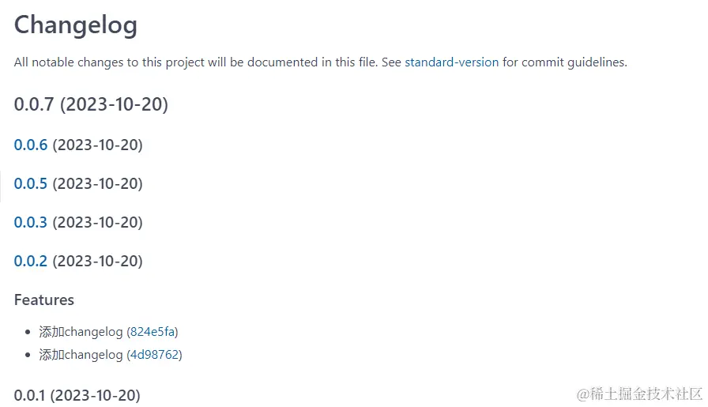

### changelog添加emoji表情

1.安装**conventional-changelog-gitmoji-config**

[conventional-changelog-gitmoji-config](https://link.juejin.cn/?target=https%3A%2F%2Fgithub.com%2Farvinxx%2Fgitmoji-commit-workflow%2Fblob%2Fmaster%2Fpackages%2Fchangelog)

```bash
npm install --save-dev conventional-changelog-gitmoji-config
```

2.修改**package.json**中的配置：

```json
{
    "scripts": {
        "release": "standard-version --preset gitmoji-config",
    }
}
```

standard-version 通过 --preset 命令另外指定预设，所以在**standard-version**后面添加 **--preset gitmoji-config**来指定预设为**gitmoji-config**。

3.修改`.versionrc.cjs`文件的内容：

```js
module.exports = {
  types: [
    { type: 'feat', section: '✨ Features | 新功能' },
    { type: 'fix', section: '🐛 Bug Fixes | Bug 修复' },
    { type: 'init', section: '🎉 Init | 初始化' },
    { type: 'docs', section: '✏️ Documentation | 文档' },
    { type: 'style', section: '💄 Styles | 风格' },
    { type: 'refactor', section: '♻️ Code Refactoring | 代码重构' },
    { type: 'perf', section: '⚡ Performance Improvements | 性能优化' },
    { type: 'test', section: '✅ Tests | 测试' },
    { type: 'revert', section: '⏪ Revert | 回退' },
    { type: 'build', section: '📦‍ Build System | 打包构建' },
    { type: 'chore', section: '🚀 Chore | 构建/工程依赖/工具' },
    { type: 'ci', section: '👷 Continuous Integration | CI 配置' }
  ]
}
```

效果：

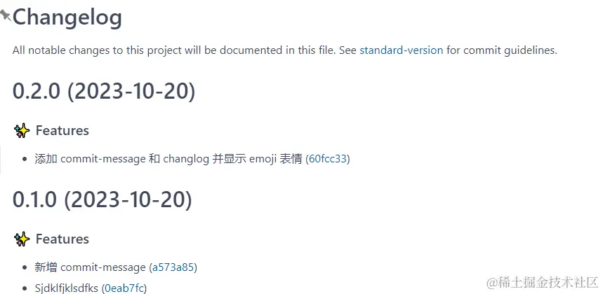

# 七、配置模块路径别名和环境

在 vite.config.js

```js
import { fileURLToPath, URL } from 'node:url'

export default defineConfig({
    // env文件目录
    envDir: "env",
    // 环境变量前缀
    // envPrefix: 'LIU',
    plugins: [vue()],
    resolve: {
        // 配置别名
        alias: {
            '@': fileURLToPath(new URL('./src', import.meta.url))
        }
    }
});
```

# 八、CSS样式管理

## CSS样式管理

## css 预处理器

这里我们选择的是**sass/scss**

```bash
npm install --save-dev sass
```

### 样式目录结构

```scss
variables.scss // 全局Sass变量
mixin.scss // 全局混入 mixin
common.scss // 全局公共样式
transition.scss // 全局过度动画样式
index.scss // 组织统一导出
```

常见的工作流是，全局样式都写在`src/styles`目录下，每个页面自己对应的样式都写在自己的`.vue`文件之中。

### normalize.css

安装`normalize.css`，用来清除浏览器的默认样式，然后在`index.scss`中引入。

```bash
pnpm add normalize.css

// index.scss
@use 'normalize.css';
```

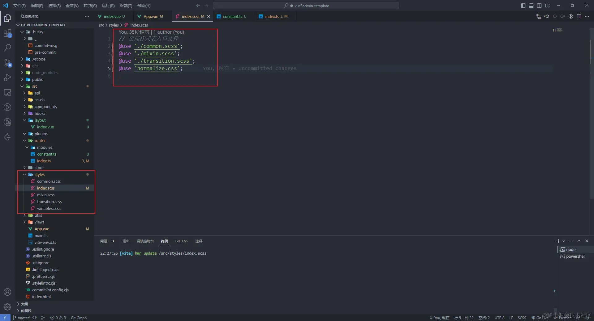

然后在main.ts中引入**index.scss**即可。

如果想在组件中**使用全局css变量**的话，需要在组件中单独引入全局变量的`.scss`文件。

### css.preprocessorOptions

vite官方提供了指定传递给 CSS 预处理器的选项，所有预处理器选项还支持 `additionalData` 选项，可以用于为每个样式内容注入额外代码。只要将全局变量的`.scss`文件的路径作为 `additionalData` 的value就可以不用再在每一个组件中都去引入一次了，就相当于全局加载了scss变量的文件。

```js
import { defineConfig } from 'vite'

export default defineConfig({
  plugins: [
    vue(),
    eslint({
      cache: false
    })
  ],
  resolve: {
    // 路径别名
    alias: [{ find: '@', replacement: pathResolve('src') }]
  },
  css: {
    preprocessorOptions: {
      scss: {
        additionalData: '@use "@/styles/variables.scss" as *;'
      }
    }
  }
})
```

# 九、路由router

## 路由router

### 安装路由

```bash
npm install vue-router@4
```

### 注册路由

在项目`src/router`目录下创建`index.ts`文件：

在`index.ts`中：

```js
// router/index.ts

import type { App } from 'vue'
import { createRouter, createWebHistory, type Router, type RouteRecordRaw } from 'vue-router'

/** 引入modules目录下的所有.ts模块 */
const modules: Record<string, any> = import.meta.glob('./modules/*.ts', { eager: true })
console.log(modules)
/** 所有模块暴露的路由配置 */
const routeList: RouteRecordRaw[] = []

/** 遍历moduls的所有key拿到所有模块暴露的内容 */
Object.keys(modules).forEach((key) => {
  routeList.push(...modules[key].default)
})

console.log('routeList', routeList)

/** 存放路由的列表 */
const routes: RouteRecordRaw[] = []

/** 创建路由实例对象 */
const router: Router = createRouter({
  history: createWebHistory(), // 路由的模式，这里是history模式
  routes: routes.concat(routeList) // 路由列表
})

/** 注册路由实例对象 */
export function setupRouter(app: App): void {
  app.use(router)
}

/** 向外暴露路由实例对象 */
export default router

```

创建`router/router.type.d.ts`文件，它的作用是用来声明路由的格式以及其他路由模块用到的规则：

```js
//  router.type.d.ts

import type { Component, VNode } from 'vue'

/** 路由格式 */
export interface DDRouteRecordRaw {
  /** 路由地址 */
  path: string
  /** 路由名称 */
  name?: string
  /** 路由地址对应的组件 */
  component?: Component
  /** 路由重定向 */
  redirect?: string
  /** 路由元信息 */
  meta?: {
    /** 侧边栏菜单标题 */
    title?: string
    /** 侧边栏菜单图标 */
    icon?: VNode | string
    /** 侧边栏中的排序---只有顶级菜单才有 */
    sort?: number
    /** 是否显示在侧边栏中 */
    sidebarVisibility?: boolean
  }
  /** 子路由 */
  children?: DDChildrenRouteRecordRaw[]
}

/** 子路由格式 */
export interface DDChildrenRouteRecordRaw {
  /** 路由地址 */
  path: string
  /** 路由名称 */
  name?: string
  /** 路由地址对应的组件 */
  component?: Component
  /** 路由元信息 */
  meta: {
    /** 侧边栏菜单标题 */
    title?: string
    /** 侧边栏菜单图标 */
    icon?: VNode | string
    /** 页面权限 */
    roles?: string
    /** 按钮级别权限 */
    auths?: string
  }
  /** 子路由 */
  children?: DDChildrenRouteRecordRaw[]
}
```

创建`src/router/modules/map.ts`目录，它是用来存放各个模块的路由配置：

```js
import type { DDRouteRecordRaw } from '../router.type'

/** 地图模块路由配置 */
const routes: DDRouteRecordRaw[] = [
   {
     path: '/map',
     redirect: '/map/index',
     meta: {
       sort: 0,
       title: '地图',
       icon: '',
       sidebarVisibility: false
     },
     children: [
       {
         path: 'index',
         name: 'Map',
         component: () => import('@/views/map/index.vue'),
         meta: {
           title: '地图',
           icon: ''
         }
       }
     ]
   }
 ]

export default routes
```

**App.vue**：

```html
<template>
  <div class="app">
    <router-view></router-view>
  </div>
</template>

<script setup lang="ts">
defineOptions({
  name: 'App'
})
</script>

<style lang="scss" scoped>
    .app {
      background-color: $color;
    }
</style>
```

